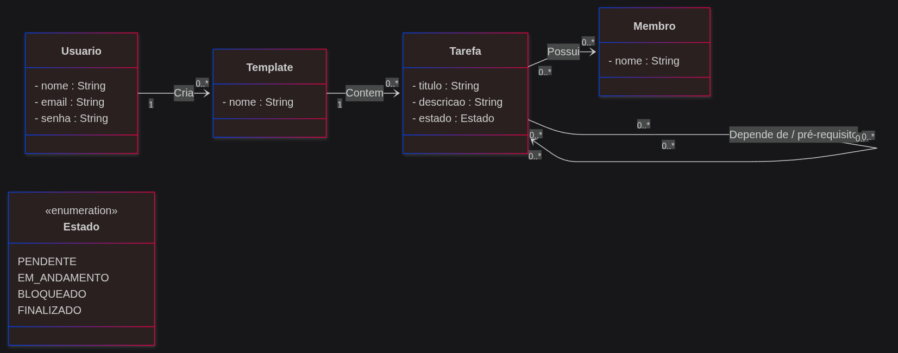

# Dependency Heaven - Paraíso das Dependências

Sistema de gerenciamento de tarefas com designação de dependências.

## Diagrama de Classes


## Ferramentas Escolhidas

- **Controle de Versão**: Git e GitHub
- **Automação de Build**: Maven
- **Testes**: JUnit (fornecido via Spring Boot Test)
- **Issue Tracking & CI/CD**: Funcionalidades nativas do GitHub (GitHub Issues e Actions)
- **Container**: Docker e Docker Compose (para implantações futuras)

## Frameworks Reutilizados

- **Back-End**: Java 21 com Spring Boot e Spring Data JPA (utilizando banco de dados H2 para facilitar os testes em laboratório sem instalação adicional de banco).
- **Front-End**: Angular (TypeScript)

## Como Gerar a Documentação do Código

A documentação do código (JavaDoc) pode ser gerada usando o plugin do Maven. Para isso, execute o seguinte comando no terminal (na raiz do projeto):

```bash
./mvnw javadoc:javadoc
```
*(No Windows, você pode usar `mvnw.cmd javadoc:javadoc`)*

## Como Executar o Sistema

Para executar a aplicação (em algum computador que possui Java 21), siga estes passos:

1. Abra o terminal na pasta raiz do repositório (onde está o arquivo `pom.xml`).
2. Execute o comando do Maven Wrapper para baixar as dependências e iniciar o Spring Boot:
   ```bash
   ./mvnw spring-boot:run
   ```
   *(Se estiver no Windows, use `mvnw.cmd spring-boot:run`)*
3. Assim que o terminal indicar que a aplicação iniciou, acesse pelo seu navegador o endereço:
   [http://localhost:8080](http://localhost:8080)

Você verá uma tela básica confirmando que o sistema está no ar! Posteriormente essa tela será substituída pela nossa interface em Angular.

## Membros
- Davi Altafim
- Francisco Vassoler Merizio - 2024102652
- Paula Monteverde