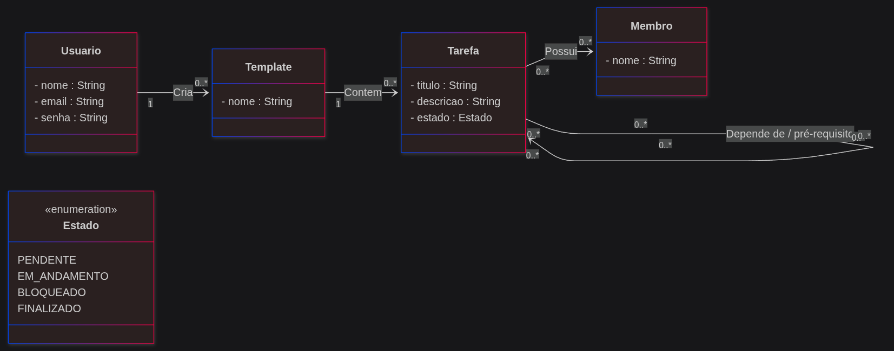

# Dependency Heaven - Paraíso das Dependências

Sistema de gerenciamento de tarefas com designação de dependências.

## Diagrama de Classes


## Ferramentas Escolhidas

- **Controle de Versão**: Git e GitHub
- **Automação de Build**: Maven
- **Testes**: JUnit (fornecido via Spring Boot Test)
- **Issue Tracking & CI/CD**: Funcionalidades nativas do GitHub (GitHub Issues e Actions)
- **Container**: Docker e Docker Compose (para implantações futuras)

## Frameworks Reutilizados

- **Back-End**: Java 21 com Spring Boot e Spring Data JPA (utilizando banco de dados H2 para facilitar os testes em laboratório sem instalação adicional de banco).
- **Front-End**: Angular (TypeScript)

## Como Gerar a Documentação do Código

A documentação do código (JavaDoc) pode ser gerada usando o plugin do Maven. Para isso, execute o seguinte comando no terminal (na pasta do back-end):

```bash
cd back-end
./mvnw javadoc:javadoc
```
*(No Windows, você pode usar `mvnw.cmd javadoc:javadoc`)*

## Como Executar o Sistema

### Opção 1: Execução Nativa

Para executar a aplicação diretamente na sua máquina, siga estes passos:

#### Back-End (Requer Java 21)
1. Abra o terminal na pasta `back-end`.
2. Execute o comando para baixar as dependências e iniciar o Spring Boot:
   ```bash
   ./mvnw spring-boot:run
   ```
   *(Se estiver no Windows, use `mvnw.cmd spring-boot:run`)*
3. O servidor backend iniciará em [http://localhost:8080](http://localhost:8080).

#### Front-End (Requer Node.js)
1. Abra o terminal na pasta `front-end`.
2. Instale as dependências e inicie o servidor de desenvolvimento do Angular:
   ```bash
   npm install
   npm start
   ```
3. O frontend estará disponível em [http://localhost:4200](http://localhost:4200).

### Opção 2: Execução via Docker (Requer Docker e Docker Compose)

Para executar a aplicação completa utilizando containers (sem necessidade de ter o Java ou Node.js instalados na máquina local):

1. Abra o terminal na pasta raiz do repositório.
2. Execute o comando do Docker Compose para construir as imagens e iniciar os containers do back-end e front-end:
   ```bash
   docker compose up --build
   ```
3. Acesse a aplicação pelos seguintes endereços:
   - **Front-End (Angular)**: [http://localhost:4200](http://localhost:4200)
   - **Back-End (Spring Boot)**: [http://localhost:8080](http://localhost:8080)

## Membros
- Davi Altafim
- Francisco Vassoler Merizio - 2024102652
- Paula Monteverde